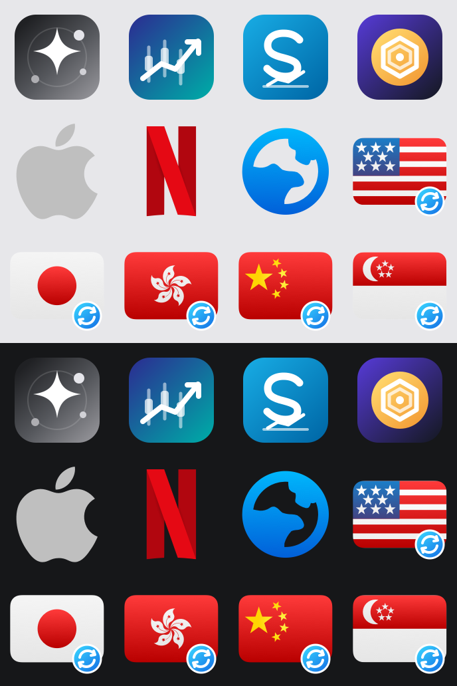

# Lane policy icons

Lane keeps every policy icon used by generated profiles in this directory. The
published base URL is:

```text
https://raw.githubusercontent.com/wenjinliuu/Lane/main/assets/icons
```

All runtime icon paths are declared in `config/icons.yaml`; generated profiles
must not depend on an external icon repository.



## Lane originals

`lane/` contains 144 × 144 PNG outputs and editable SVG sources:

| Icon | Design intent |
| --- | --- |
| `AI` | Neutral gray, high-contrast AI sparkle that stays visible on light and dark UI backgrounds |
| `Brokerage` | Generic market chart so the combined Futu / Tiger / Longbridge group does not imply a single broker |
| `Crypto` | Generic digital-asset mark so the Binance / OKX / Bybit / Bitget group does not imply Binance only |
| `Schwab` | Blue `S` identifier for the dedicated Schwab group; not an official Schwab artwork |
| `Auto_Badge` | Blue circular-arrows badge used on the five regional Auto icons |

The clients accept one icon URL rather than light/dark variants. Lane therefore
uses a neutral filled tile and high-contrast symbol instead of claiming dynamic
theme switching.

## Qure assets

`third-party/qure/` contains an attributed subset copied unchanged from
[`Koolson/Qure`](https://github.com/Koolson/Qure) commit
`b16b260625f873266f6a6a9b88710132774997b8`.

Qure does not publish these files under a standard open-source license. Its
README requests attribution, restricts commercial use, and states that the
underlying marks remain the property of their respective owners. These files
are not covered by Lane's MIT license.

`third-party/qure-derived/` contains the five Qure country/region icons with
Lane's `Auto_Badge` composited in the lower-right corner. They remain derivative
Qure assets and follow the same upstream conditions.

Apple, Netflix, Microsoft, GitHub, Telegram, X, YouTube, TikTok, Emby, Steam,
Google, Schwab and other names or marks belong to their respective owners. They
are used only to identify the corresponding user-selected routing group; Lane
is not affiliated with or endorsed by those owners.
